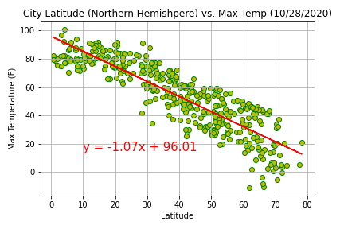
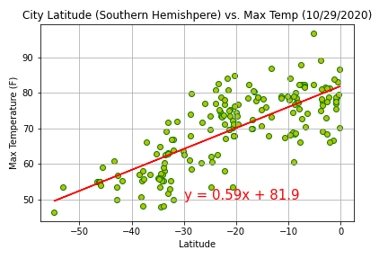
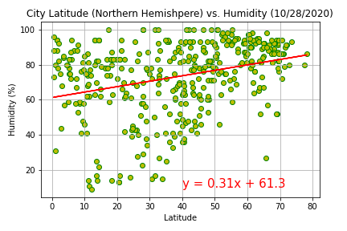
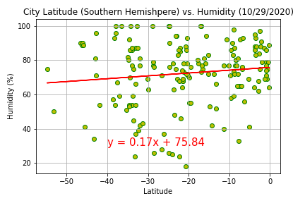
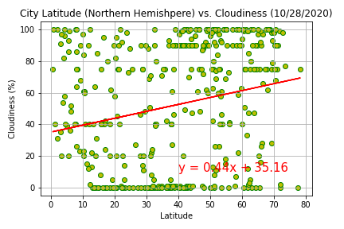
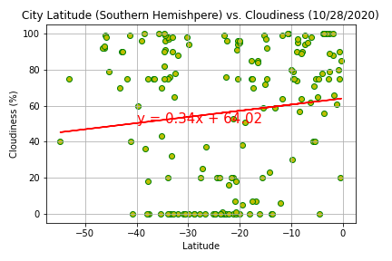
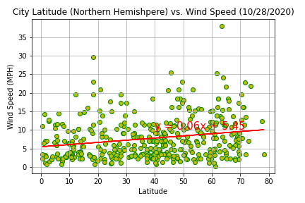
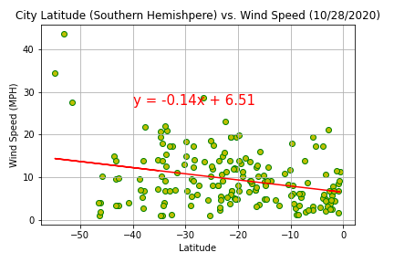
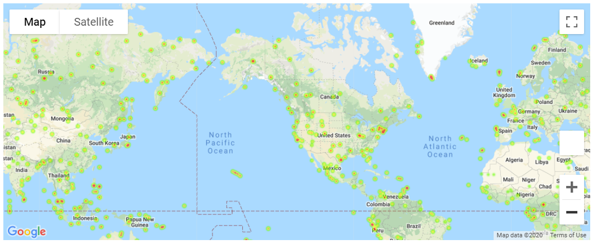
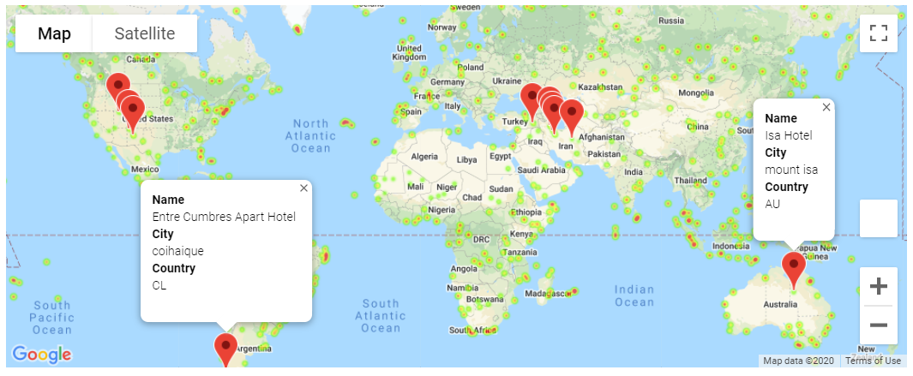

# Weather Analysis and Vacation Spots

- **_Weather Analysis_** - [WeatherPy.ipynb](WeatherPy/WeatherPy.ipynb) is a Jupyter Notebook that does a weather analysis on a set ~500 randomly selected cities via the citipy package (these cities are saved to a csv file for the below Vacation Spot). It uses the open weather api to collect current weather statistics on each of the cities selected. These cities are then applied to a series of scatter plots that compare latitude to 4 weather attributes, Max Temp, Humiditiy, Cloudiness, and Wind Speed. The analysis is further split into Northern and Southern Hemisphere scatter plots and then linear regression is applied on top.

- **_Vacation Spots_** - [VacationPy.ipynb](VacationPy/VacationPy.ipynb) is a Jupyter Notebook that uses the Google maps API to plot Humidity heat map for the city latitude and longitudes from the cities data file produced by the previous Weather analysis. The cities data is further filtered by a series of preferences on an ideal vacation location driven by selections based on Max Temp, Humidity, Cloudiness and Wind Speed. This filtered data is used against the Google places API to find the nearest Hotel to that target city latitude and longitude. A marker layer is then applied to the Humidity map to show those Hotels.

## Files

- Weather Analysis

  - [WeatherPy.ipynb](WeatherPy/WeatherPy.ipynb) - Jupyter Notebook for the Weather Analysis

  - [City Data](WeatherPy/output_data/cities.csv) - City data output file generate to be used by [VacationPy.ipynb](VacationPy/VacationPy.ipynb)

- Vacation Spots

  - [City Data](WeatherPy/output_data/cities.csv) - City data which was generated from [WeatherPy.ipynb](WeatherPy/WeatherPy.ipynb)

  - [VacationPy.ipynb](VacationPy/VacationPy.ipynb) - Jupyter Notebook for the Vacation Spots

## Results

- World City Max Temps

  

- World City Humidities

  

- World City Cloudinesses

  

- World City Wind Speeds

  

- Northern Hemisphere City Max Temp with Linear Regression

  

- Southern Hemisphere City Max Temp with Linear Regression

  

- Northern Hemisphere City Humidity with Linear Regression

  

- Southern Hemisphere City Humidity with Linear Regression

  

- Northern Hemisphere City Couldiness with Linear Regression

  

- Southern Hemisphere City Cloudiness with Linear Regression

  

- Northern Hemisphere City Wind Speed with Linear Regression

  

- Southern Hemisphere City Wind Speed with Linear Regression

  

- World City Humidity Heatmap

  

- World City Humidity Heatmap with Hotel Marks

  

## Analysis

## Execution

1. The assumption is that you have a working Python 3.6 environment
1. Clone the [`git repository`](https://github.com/jayhjman/python-api-challenge) for this project
1. Change into the [`repository directory`](https://github.com/jayhjman/python-api-challenge) and then into [`WeatherPy`](WeatherPy/) or [`VacationPy`](VacationPy/)

## Author

Made by Jay with :heart: in 2020.
