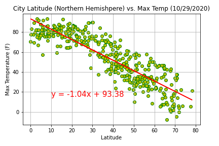
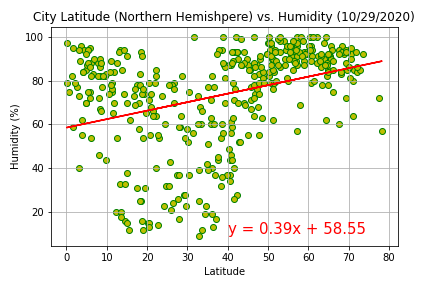
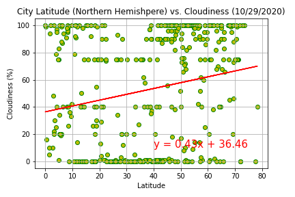
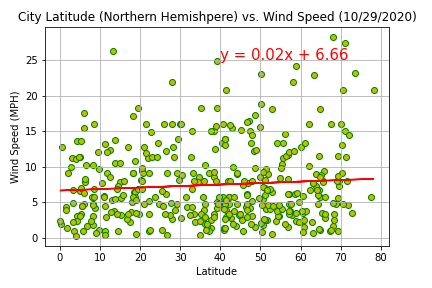
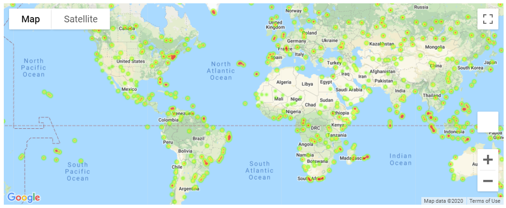

# Weather Analysis and Vacation Spots

- **_Weather Analysis_** - [WeatherPy.ipynb](WeatherPy/WeatherPy.ipynb)

- **_Vacation Spots_** - [VacationPy.ipynb](VacationPy/VacationPy.ipynb)

## Files

- Weather Analysis

  - [WeatherPy.ipynb](WeatherPy/WeatherPy.ipynb) - Jupyter Notebook for the analysis

- Vacation Spots

  - [City Data](WeatherPy/output_data/cities.csv) - City data

  - [VacationPy.ipynb](VacationPy/VacationPy.ipynb) - Jupyter Notebook for the Vacation maps

## Results

- X

  

- X

  

- X

  

- X

  

- X

  

- X

  

- X

  

- X

  

- Northern Hemisphere City Couldiness with Linear Regression

  

- Southern Hemisphere City Cloudiness with Linear Regression

  

- Northern Hemisphere City Wind Speed with Linear Regression

  

- Southern Hemisphere City Wind Speed with Linear Regression

  

- World City Humidity Heatmap with Hotel Marks for VacationPy

  

- World City Humidity Heatmap with Hotel Marks for VacationPy

  

## Analysis

## Execution

1. The assumption is that you have a working Python 3.6 environment
1. Clone the [`git repository`](https://github.com/jayhjman/python-api-challenge) for this project
1. Change into the [`repository directory`](https://github.com/jayhjman/python-api-challenge) and then into [`WeatherPy`](WeatherPy/) or [`VacationPy`](VacationPy/)

## Author

Made by Jay with :heart: in 2020.
